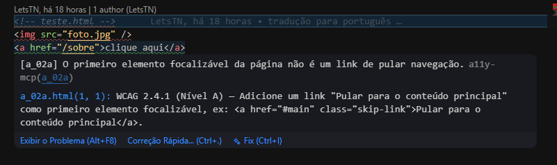
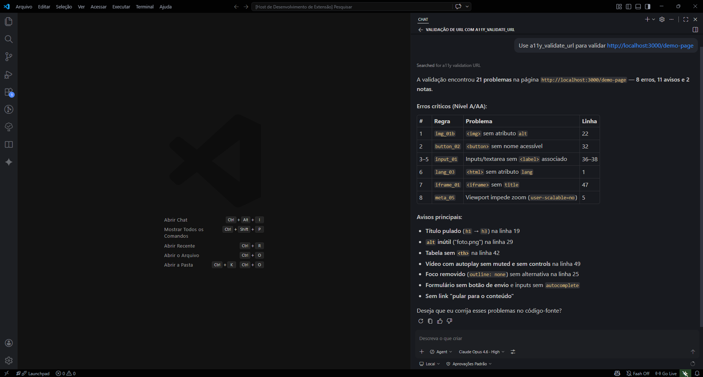

# A11y MCP — Validador de Acessibilidade

> Valida a acessibilidade **WCAG 2.2 (AAA)** em arquivos HTML, JSX e TSX — diretamente no VS Code, com diagnósticos inline e ferramentas para o GitHub Copilot.


---

## Funcionalidades

### Diagnósticos inline

Os problemas aparecem instantaneamente no **painel de Problemas** (e como sublinhados no editor) toda vez que você abre ou salva um arquivo.



### Ferramentas para o GitHub Copilot (MCP)

Peça ao Copilot Chat para auditar seus arquivos ou explicar qualquer regra:

| Ferramenta                | O que faz                                                                                                                                                                                          |
| ------------------------- | -------------------------------------------------------------------------------------------------------------------------------------------------------------------------------------------------- |
| `a11y_validate_file`      | Relatório completo de um único arquivo — linha, regra, critério WCAG, severidade e sugestão de fix                                                                                                 |
| `a11y_validate_workspace` | Varre todos os arquivos HTML/JSX/TSX e retorna um resumo geral                                                                                                                                     |
| `a11y_validate_url`       | Valida a acessibilidade de uma URL. Com Playwright instalado, usa **browser headless + axe-core** para análise completa (contraste, foco, teclado). Sem Playwright, faz HTTP fetch com análise estática |
| `a11y_get_rule`           | Explica qualquer regra em detalhes (ex.: `img_01b`, `hx_03`, `aria_02`)                                                                                                                           |



**Exemplos de prompts:**

```
Valide a acessibilidade de src/pages/Home.tsx
```

```
O que significa a regra hx_03 e como corrijo?
```

```
Valide a URL http://localhost:3000
```

```
Escaneie o workspace inteiro em busca de erros WCAG e me dê um resumo
```

### Comandos

| Comando                       | Descrição                                       |
| ----------------------------- | ----------------------------------------------- |
| `A11y: Validar Arquivo Atual` | Executa na aba ativa do editor                  |
| `A11y: Validar Workspace`     | Varre todos os arquivos suportados no workspace |

---

## Regras cobertas

### Análise estática (85 regras)

A extensão implementa **85 regras** de análise estática baseadas no [ruleset do AccessMonitor](https://amagovpt.github.io/accessmonitor-rulesets/) e no [WCAG 2.2](https://www.w3.org/TR/WCAG22/). Essas regras funcionam em **todos os modos**: diagnósticos inline, `a11y_validate_file`, `a11y_validate_workspace` e `a11y_validate_url`.

| Categoria | Regras | IDs |
|-----------|--------|-----|
| **Imagens** | Alt ausente, alt não informativo, alt muito longo, decorativo não oculto, input image sem alt, area sem alt | `img_01b` `img_02` `img_03` `img_04` `inp_img_01b` `area_01b` |
| **Links** | Nome acessível ausente, links adjacentes idênticos, mesmo texto com URLs diferentes, título redundante, link de imagem sem alt, link javascript: | `a_11` `a_06` `a_09` `a_10` `a_03` `a_05` `win_01` |
| **Botões** | Nome acessível ausente | `button_02` |
| **Formulários** | Label ausente, label vazio ou sem controle, autocomplete ausente, alt em input não-image, aria-label não contém texto visível, fieldset sem legend, form sem submit | `input_01` `input_02` `input_03` `label_02` `label_03` `autocomplete_01` `field_01` `form_01b` |
| **Títulos** | Sem H1, múltiplos H1, níveis pulados, heading vazio, heading só com imagens sem alt, nenhum heading na página | `hx_01a` `hx_01c` `hx_03` `heading_02` `heading_04` `hx_02` |
| **Página** | `<title>` ausente/vazio, título curto/longo, caracteres especiais no título, `lang` ausente/inválido, `lang` inválido em elementos | `title_02` `title_03` `title_04` `title_05` `lang_03` `lang_02` `element_07` |
| **Landmarks** | `<main>` ausente/duplicado, skip nav ausente/duplicado, banner duplicado, contentinfo duplicado | `landmark_07` `landmark_14` `a_02a` `a_02b` `landmark_10` `landmark_12` |
| **Tabelas** | Sem `<th>`, sem `<caption>`, aninhadas, headers referenciando ID inexistente, scope em `<td>`, tabela com role conflitante | `table_05a` `table_02` `table_04` `headers_02` `scope_01` `table_06` |
| **Frames** | `<iframe>` sem título, títulos duplicados, tabindex negativo, `<frame>` sem título | `iframe_01` `iframe_02` `iframe_04` `frame_01` |
| **SVG** | SVG significativo sem nome acessível | `svg_02` |
| **ARIA** | Role inválido, atributo obrigatório ausente, atributo desconhecido, valores booleanos/token inválidos, ARIA reference inválida, role conflitante | `aria_01` `aria_02` `aria_03` `aria_04` `aria_07` `role_02` |
| **Árvore de acessibilidade** | IDs duplicados, focusable dentro de aria-hidden, focusable com aria-hidden, role presentacional com conteúdo focável | `id_02` `element_02` `element_03` `element_09` |
| **Meta** | Zoom desativado, auto-redirect, delayed refresh | `meta_05` `meta_01` `meta_02` `meta_04` |
| **Mídia** | Sem controles, autoplay sem muted | `audio_video_01` `audio_video_02` |
| **Eventos** | Mouse sem teclado, dblclick sem teclado, tabindex > 0 | `ehandler_04` `ehandler_02` `element_01` |
| **Estrutura** | BR consecutivos, text-decoration: blink, abbr sem title, object sem nome acessível | `br_01` `blink_02` `abbr_01` `object_02` |
| **Obsoleto** | Elementos apresentacionais obsoletos (`<center>`, `<font>`, etc.) | `layout_01a` `font_01` |
| **Listas** | Filhos inválidos em ul/ol, filhos inválidos em dl | `list_01` `list_03` `listitem_02` |
| **Contraste** | Contraste insuficiente (inline styles) | `color_02` |
| **Foco** | Outline removido sem alternativa | `focus_visible_01` |
| **Erros** | aria-invalid sem mensagem de erro | `error_id_01` |
| **Status** | role="status"/"alert" sem aria-live | `status_msg_01` |
| **JSX** | onClick em elemento não interativo sem role/teclado | `jsx_onclick_div` |

#### Critérios WCAG cobertos (27 critérios)

| Critério WCAG | Nome | Nível | Regras |
|---------------|------|-------|--------|
| 1.1.1 | Non-text Content | A | `img_01b` `img_02` `img_03` `img_04` `svg_02` `area_01b` `inp_img_01b` `object_02` |
| 1.2.1 | Audio-only and Video-only | A | `audio_video_01` |
| 1.3.1 | Info and Relationships | A | `input_01` `label_02` `hx_03` `table_05a` `table_02` `table_04` `layout_01a` `font_01` `listitem_02` `table_06` `br_01` `element_09` `field_01` `headers_02` `hx_02` `input_02` `landmark_10` `landmark_12` `list_01` `list_03` `scope_01` |
| 1.3.5 | Identify Input Purpose | AA | `autocomplete_01` |
| 1.4.2 | Audio Control | A | `audio_video_02` |
| 1.4.3 | Contrast (Minimum) | AA | `color_02` |
| 1.4.4 | Resize Text | AA | `meta_05` |
| 2.1.1 | Keyboard | A | `ehandler_04` `ehandler_02` `role_02` `jsx_onclick_div` `iframe_04` `win_01` `audio_video_01` |
| 2.2.1 | Timing Adjustable | A | `meta_01` `meta_04` |
| 2.2.2 | Pause, Stop, Hide | A | `blink_02` |
| 2.2.4 | Interruptions | AAA | `meta_01` `meta_04` |
| 2.4.1 | Bypass Blocks | A | `hx_01a` `landmark_07` `landmark_14` `a_02a` `a_02b` |
| 2.4.2 | Page Titled | A | `title_02` `title_03` `title_04` `title_05` |
| 2.4.3 | Focus Order | A | `element_01` |
| 2.4.4 | Link Purpose (In Context) | A | `a_11` `a_06` `a_09` `a_03` `a_05` `area_01b` |
| 2.4.6 | Headings and Labels | AA | `heading_02` `hx_01a` `hx_01c` `hx_03` `heading_04` `hx_02` |
| 2.4.7 | Focus Visible | AA | `focus_visible_01` |
| 2.4.9 | Link Purpose (Link Only) | AAA | `a_09` `a_03` |
| 2.5.3 | Label in Name | A | `label_03` |
| 3.1.1 | Language of Page | A | `lang_03` `lang_02` |
| 3.1.2 | Language of Parts | AA | `element_07` |
| 3.1.4 | Abbreviations | AAA | `abbr_01` |
| 3.2.2 | On Input | A | `form_01b` |
| 3.2.5 | Change on Request | AAA | `a_10` `meta_02` `meta_04` |
| 3.3.1 | Error Identification | A | `error_id_01` |
| 3.3.2 | Labels or Instructions | A | `input_01` `field_01` |
| 4.1.2 | Name, Role, Value | A | `a_11` `button_02` `iframe_01` `aria_01` `aria_02` `aria_03` `aria_04` `aria_07` `id_02` `role_02` `jsx_onclick_div` `a_03` `element_02` `element_03` `element_09` `frame_01` `iframe_02` `inp_img_01b` `input_02` `input_03` |
| 4.1.3 | Status Messages | AA | `status_msg_01` |

### Análise em tempo de execução via `a11y_validate_url` (Playwright + axe-core)

Quando o [Playwright](https://playwright.dev/) está instalado, a ferramenta `a11y_validate_url` ganha superpoderes:

1. **Abre um browser headless** (Chromium) e navega até a URL
2. **Espera o JavaScript renderizar** — funciona com SPAs (React, Vue, Angular)
3. **Roda as 85 regras estáticas** no DOM renderizado
4. **Injeta e executa o [axe-core](https://github.com/dequelabs/axe-core)** para análise profunda em tempo de execução

O axe-core adiciona **50+ regras extras** cobrindo critérios que análise estática não alcança:

| Critério WCAG | Nome | Nível | O que detecta |
|---------------|------|-------|---------------|
| 1.4.1 | Use of Color | A | Links indistinguíveis apenas por cor |
| 1.4.3 | Contrast (Minimum) | AA | Contraste insuficiente via computed styles |
| 1.4.6 | Contrast (Enhanced) | AAA | Contraste com limiar mais alto (7:1) |
| 1.4.11 | Non-text Contrast | AA | Contraste de bordas e componentes de UI |
| 2.1.2 | No Keyboard Trap | A | Armadilhas de teclado |
| 2.4.7 | Focus Visible | AA | Indicador de foco ausente (computed styles) |
| 2.4.11 | Focus Not Obscured | AA | Foco obstruído por outros elementos |
| 3.2.1 | On Focus | A | Mudanças de contexto no foco |
| 3.3.1 | Error Identification | A | Erros de formulário não identificados |
| 4.1.3 | Status Messages | AA | Mensagens de status sem live regions |
| … | + dezenas de best practices | — | Roles, landmarks, labels, ARIA patterns |

#### Como instalar o Playwright (opcional)

```bash
npm install playwright
npx playwright install chromium
```

> Sem o Playwright, `a11y_validate_url` funciona normalmente via HTTP fetch — só com as 85 regras estáticas.

---

## Tipos de arquivo suportados

- HTML (`.html`, `.htm`)
- JSX / TSX (`.jsx`, `.tsx`)
- JavaScript / TypeScript com JSX (`.js`, `.ts`)

---

## Configurações da extensão

| Configuração            | Padrão                                  | Descrição                                                                                 |
| ----------------------- | --------------------------------------- | ----------------------------------------------------------------------------------------- |
| `a11y-mcp.wcagLevel`    | `AAA`                                   | Nível mínimo de conformidade WCAG (`A`, `AA`, `AAA`)                                      |
| `a11y-mcp.include`      | `["**/*.html", "**/*.jsx", "**/*.tsx"]` | Padrões glob dos arquivos a validar                                                       |
| `a11y-mcp.exclude`      | `["**/node_modules/**", ...]`           | Padrões glob dos arquivos a excluir da validação                                          |
| `a11y-mcp.configFile`   | `".a11y-mcp.json"`                      | Caminho do arquivo de mapeamento de componentes (relativo à raiz do workspace ou absoluto) |

---

## Mapeamento de componentes React / bibliotecas

Por padrão, a extensão só valida elementos HTML nativos em JSX/TSX (ex.: ``, `<button>`, `<a>`). Se o seu projeto usa componentes personalizados ou de bibliotecas (Material UI, Chakra, etc.), você pode mapear cada componente para o elemento HTML equivalente.

### Como configurar

Crie um arquivo `.a11y-mcp.json` na raiz do seu projeto (ou configure o caminho via `a11y-mcp.configFile`):

```json
{
  "components": {
    "Button": {
      "as": "button"
    },
    "IconButton": {
      "as": "button",
      "propMap": {
        "aria-label": "ariaLabel"
      }
    },
    "Link": {
      "as": "a",
      "propMap": {
        "href": "to"
      }
    },
    "Image": {
      "as": "img"
    },
    "TextField": {
      "as": "input",
      "propMap": {
        "aria-label": "label",
        "id": "id",
        "type": "type"
      }
    }
  }
}
```

### Campos

| Campo     | Obrigatório | Descrição                                                                                                                |
| --------- | ----------- | ------------------------------------------------------------------------------------------------------------------------ |
| `as`      | Sim         | Tag HTML nativa equivalente (`button`, `a`, `img`, `input`, etc.)                                                        |
| `propMap` | Não         | Mapa de atributos: chave = atributo HTML padrão, valor = nome da prop no componente. Ex.: `{ "aria-label": "ariaLabel" }` |

### Como funciona

- `<IconButton />` será validado como `<button>` — e flagged por não ter nome acessível
- `<IconButton ariaLabel="Fechar" />` passará a validação (o `ariaLabel` é mapeado para `aria-label`)
- `<Link to="/home">Início</Link>` será validado como `<a href="/home">` — com todas as regras de links aplicadas
- Componentes com `MemberExpression` também são suportados: `<Mui.Button>` resolve para `Button` no mapa

### Dicas

- O arquivo é cacheado. A extensão revalida automaticamente os documentos abertos quando o `.a11y-mcp.json` é alterado
- Veja o arquivo `.a11y-mcp.example.json` na raiz do repositório para um exemplo completo
- Componentes **não mapeados** continuam sendo ignorados (mesmo comportamento anterior)

---

## Como funcionam os diagnósticos

Cada problema exibe:

- **ID da regra** — ex.: `img_01b`
- **Severidade** — Erro 🔴, Aviso 🟡 ou Aviso informativo 🔵
- **Critério WCAG** — ex.: `1.1.1`, `2.4.4`
- **Nível de conformidade** — A, AA ou AAA
- **Sugestão de correção** — descrição prática do que alterar
- **Link de referência** — página da regra no AccessMonitor

---

## Referências

- [Rulesets do AccessMonitor](https://amagovpt.github.io/accessmonitor-rulesets/)
- [WCAG 2.2 — W3C](https://www.w3.org/TR/WCAG22/)
- [WAI-ARIA 1.2 — W3C](https://www.w3.org/TR/wai-aria-1.2/)
- [ACT Rules Community Group](https://act-rules.github.io/rules/)

---

## Contribuição

Issues e pull requests são bem-vindos em [github.com/LetsTN/a11y-mcp](https://github.com/LetsTN/a11y-mcp).

## Licença

[MIT](LICENSE)
